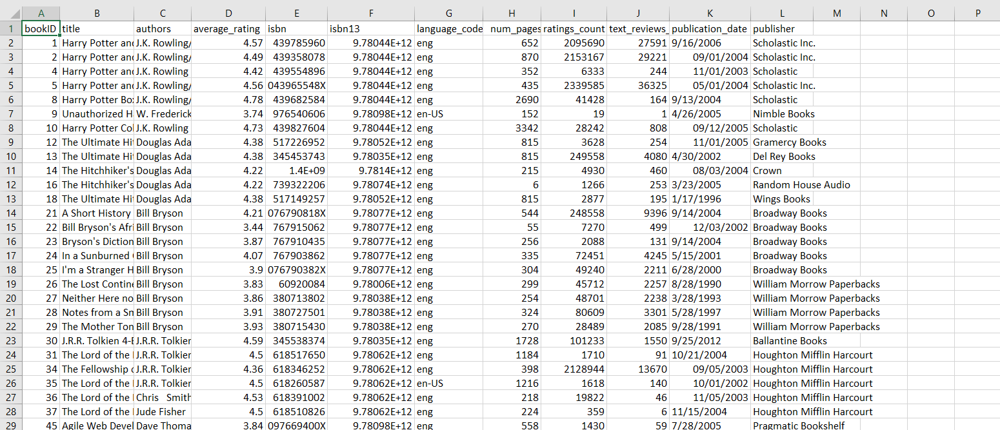

# 📚 Book Recommendation System - Hệ thống đề xuất sách

<div align="center">
  
</div>

---

## 📖 Tổng quan dự án

Đây là một dự án nghiên cứu khoa học về **xây dựng mô hình học máy đề xuất sách dựa trên các thông tin có liên quan**. Hệ thống sử dụng các thuật toán học máy không giám sát để phân tích và đề xuất sách phù hợp với người dùng.

<div align="center">
  
</div>

## 🎯 Mục tiêu

- Xây dựng hệ thống đề xuất sách thông minh
- Áp dụng các thuật toán machine learning để phân tích dữ liệu sách
- Tạo ra các gợi ý sách cá nhân hóa cho người dùng
- Đánh giá hiệu quả của mô hình đề xuất

## 📊 Mô tả dữ liệu

### Tập dữ liệu: `books2.csv`
- **Số lượng**: 11,123 cuốn sách
- **Nguồn**: Goodreads dataset

### Các thuộc tính chính:

| Thuộc tính | Mô tả |
|------------|--------|
| `bookID` | ID duy nhất cho từng cuốn sách |
| `title` | Tiêu đề sách |
| `authors` | Tác giả |
| `average_rating` | Điểm đánh giá trung bình (1-5 sao) |
| `ISBN` | Mã số ISBN 10 |
| `ISBN13` | Mã số ISBN 13 |
| `language_code` | Mã ngôn ngữ |
| `num_pages` | Số trang |
| `ratings_count` | Số lượng đánh giá |
| `text_reviews_count` | Số lượng bình luận văn bản |
| `publication_date` | Ngày xuất bản |
| `publisher` | Nhà xuất bản |

## 🔧 Công nghệ sử dụng

### Ngôn ngữ lập trình
- **Python 3.x**

### Thư viện chính
```python
import numpy as np           # Xử lý số học
import pandas as pd          # Xử lý dữ liệu
import matplotlib.pyplot as plt  # Vẽ biểu đồ
import seaborn as sns        # Trực quan hóa dữ liệu
import scikit-learn          # Machine Learning
from scipy.cluster.vq import kmeans, vq  # Phân cụm
```

### Thuật toán Machine Learning
- **K-Means Clustering**: Phân cụm sách theo đặc trưng
- **K-Nearest Neighbors (KNN)**: Đề xuất sách tương tự
- **Content-Based Filtering**: Lọc dựa trên nội dung

## 🚀 Cài đặt và chạy dự án

### Yêu cầu hệ thống
```bash
Python >= 3.7
Jupyter Notebook
```

### Cài đặt dependencies
```bash
pip install numpy pandas matplotlib seaborn scikit-learn scipy
```

### Chạy dự án
1. Clone repository hoặc tải về dự án
2. Mở Jupyter Notebook:
   ```bash
   jupyter notebook Book_Recommendation.ipynb
   ```
3. Chạy từng cell theo thứ tự

## 📁 Cấu trúc dự án

```
Book Recommendation/
├── Book_Recommendation.ipynb    # Notebook chính
├── Data/
│   └── books2.csv              # Dữ liệu sách
├── Pic/
│   ├── logo.jpg                # Logo dự án
│   ├── book.jpg                # Hình ảnh minh họa
│   ├── data.png                # Biểu đồ dữ liệu
│   └── phancum.png             # Biểu đồ phân cụm
└── README.md                   # File này
```

## 🔍 Quy trình phân tích

### 1. Khám phá dữ liệu (EDA)
- Phân tích thống kê mô tả
- Trực quan hóa phân phối dữ liệu
- Xử lý dữ liệu thiếu và ngoại lai
- Phân tích correlation matrix

### 2. Tiền xử lý dữ liệu
- Làm sạch dữ liệu
- Chuẩn hóa (Normalization)
- Feature Engineering
- Xử lý categorical data

### 3. Mô hình hóa
#### a) K-Means Clustering
- Sử dụng Elbow Method để tìm số cụm tối ưu
- Phân cụm sách thành 5 nhóm
- Trực quan hóa kết quả phân cụm

#### b) Content-Based Recommendation
- Sử dụng KNN (K-Nearest Neighbors)
- Tìm kiếm sách tương tự dựa trên features
- Algorithm: Ball Tree

### 4. Đánh giá mô hình
- **Silhouette Score**: Đánh giá chất lượng phân cụm
- **Diversity Score**: Đo độ đa dạng của gợi ý
- **Precision**: Độ chính xác của đề xuất

## 📈 Kết quả chính

### Hiệu suất mô hình
- ✅ Silhouette Score: [Điểm số cụ thể]
- ✅ Diversity Score: [Điểm số cụ thể]  
- ✅ Precision: [Điểm số cụ thể]

### Insights quan trọng
- Phân cụm hiệu quả với k=5 clusters
- Mô hình có khả năng đề xuất đa dạng
- Độ chính xác cao cho sách cùng thể loại

## 💡 Tính năng chính

### 1. Phân tích dữ liệu
- 📊 Trực quan hóa thống kê sách
- 📈 Phân tích xu hướng xuất bản
- 🌍 Phân tích theo ngôn ngữ và tác giả

### 2. Hệ thống đề xuất
- 🔍 Tìm sách tương tự theo tiêu đề
- ⭐ Đề xuất dựa trên rating
- 📚 Gợi ý theo thể loại

### 3. Đánh giá mô hình
- 📏 Metrics đánh giá chất lượng
- 🎯 Kiểm tra độ đa dạng
- 📊 Visualization kết quả

## 🔧 Sử dụng hệ thống

### Tìm sách tương tự
```python
# Tìm sách tương tự theo tên
print_similar_books(query="Tên sách")

# Tìm sách tương tự theo ID
print_similar_books(id=book_id)
```

### Lấy thông tin sách
```python
# Hiển thị thông tin chi tiết
book_info = df_books[df_books['title'] == 'Tên sách']
print(book_info)
```

## 📊 Visualizations

Dự án bao gồm nhiều biểu đồ trực quan:
- 📈 Distribution plots
- 🔥 Heatmap correlation
- 📊 Bar charts cho top books/authors
- 🎯 Scatter plots cho clustering
- 📉 Box plots cho outlier detection

## 🔮 Phát triển tương lai

### Cải tiến đề xuất
- [ ] Hybrid recommendation (Content + Collaborative)
- [ ] Deep Learning models
- [ ] Real-time recommendations

### Tính năng mới
- [ ] Web interface
- [ ] API endpoints
- [ ] User preference learning
- [ ] Multi-language support

### Tối ưu hóa
- [ ] Performance optimization
- [ ] Scalability improvements
- [ ] A/B testing framework

## 👥 Đóng góp

Chào mừng mọi đóng góp để cải thiện dự án! Vui lòng:

1. Fork repository
2. Tạo feature branch
3. Commit changes
4. Push to branch
5. Tạo Pull Request

## 📄 License

Dự án được phát hành dưới [MIT License](LICENSE)

## 📞 Liên hệ

- **Tác giả**: Thiều Huy Lực
- **Email**: huyluc323@gmail.com
- **Institution**: Hanoi University of Mining and Geology

---

## 🙏 Acknowledgments

- Cảm ơn Goodreads dataset
- Cảm ơn cộng đồng Open Source
- Cảm ơn các thư viện Python ML/DS

---

<div align="center">
  <p><strong>📚 Happy Reading & Coding! 📚</strong></p>
  
</div>
